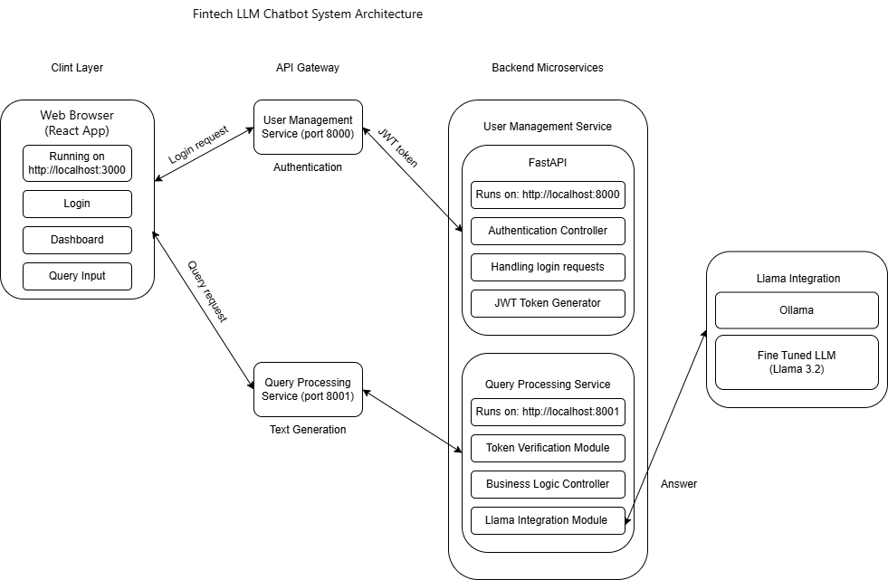

## XNL-21BAI1628-LLM-1

# Fintech LLM Chatbot System

This project is a production-grade, multi‑tier Fintech Chatbot System that leverages a fine‑tuned large language model (LLM) (simulated here with a dummy Llama 3 integration via Hugging Face Transformers) to process real-time financial queries. The system is composed of a React-based frontend for user interaction and two FastAPI-based microservices to handle authentication and query processing.  

## Table of Contents

- [Overview](#overview)
- [Architecture](#architecture)
- [Components](#components)
  - [Frontend](#frontend)
  - [User Management Service](#user-management-service)
  - [Query Processing Service](#query-processing-service)
  - [Llama3 Integration](#llama3-integration)
- [Installation & Setup](#installation--setup)
- [Usage](#usage)
- [Testing](#testing)
- [Deployment](#deployment)
- [Additional Documentation](#additional-documentation)
- [Contributing](#contributing)

## Overview

The Fintech LLM Chatbot System allows users to log in securely and send financial queries (e.g., “tell about apple stocks”). The system processes these queries by validating the user via JSON Web Tokens (JWTs) and then passing the query to a backend LLM integration component that returns an answer. The architecture is designed to be modular, scalable, and production‑grade.

## Architecture

The architecture of this project consists of the following layers:

1. **Client Layer (Frontend):**  
   - Built with **React**, **TypeScript**, **Redux**, and **Material‑UI**.
   - Provides user authentication (login / dashboard) and query submission interfaces.
   - Runs on `http://localhost:3000`.

2. **Backend Microservices:**  
   - **User Management Service:**  
     Handles secure login and JWT generation. Runs on `http://localhost:8000`.
   - **Query Processing Service:**  
     Validates JWT tokens and processes financial queries via a Llama 3 integration. Runs on `http://localhost:8001`.
   - Both services incorporate **CORSMiddleware** (using FastAPI’s middleware) to allow cross-origin requests from the frontend.

3. **LLama 3 Integration:**  
   - Uses Hugging Face’s Transformers library to simulate/query a fine‑tuned Llama 3 model.
   - Currently returns a dummy answer for testing purposes.

A high‑level architecture diagram is provided in the `docs` folder. You can view the diagram here:  


## Components

### Frontend

- **Technology:** React, TypeScript, Redux, Material‑UI.
- **Key Files:**
  - `frontend/src/app/store.ts`: Redux store configuration.
  - `frontend/src/features/user/userSlice.ts`: Redux state for user authentication.
  - `frontend/src/components/Login.tsx`: Login component that submits credentials.
  - `frontend/src/components/Dashboard.tsx`: Dashboard for displaying queries and responses.
- **Functionality:**
  - Allows users to log in using dummy credentials (e.g., test@example.com / test123).
  - Stores JWT token in Redux after successful login.
  - Sends POST requests with the financial query to the Query Processing microservice.

### User Management Service

- **Technology:** FastAPI, Python-JOSE, JWT.
- **Running on:** Port 8000.
- **Key Files:**  
  - `backend/user_management/main.py`
- **Functionality:**
  - Provides endpoint `POST /user/token` for secure login.
  - Validates user credentials against an in‑memory dummy user database.
  - Generates and returns a JWT token upon successful authentication.
  - Uses CORSMiddleware to allow requests from `http://localhost:3000`.
  
**Snippet Example:**
```python
@app.post("/user/token")
def login_for_access_token(form_data: OAuth2PasswordRequestForm = Depends()):
    user = users_db.get(form_data.username)
    if not user or user["password"] != form_data.password:
        raise HTTPException(status_code=400, detail="Incorrect username or password")
    access_token = create_access_token(data={"sub": form_data.username})
    return {"access_token": access_token, "token_type": "bearer"}
```

### Query Processing Service
- **Technology:** FastAPI, JWT, Python.
- **Running on:** Port 8001.
- **Key Files:**  
  - `backend/query_processing/main.py`
- **Functionality:**
  - Receives POST requests to /query/process_query with a JSON payload containing "query".
  - Uses OAuth2PasswordBearer to verify JWT tokens.
  - Invokes the Llama 3 integration function to process queries.
  - Implements a global middleware or explicit OPTIONS handling to satisfy CORS requirements.

**Snippet Example:**

```Python
@app.post("/query/process_query")
def process_query(query: dict, token_data: dict = Depends(verify_token)):
    received_query = query.get("query", "")
    print("Received query:", received_query)
    answer = process_query_with_llama(received_query)
    print("Generated answer:", answer)
    return {"answer": answer}
```
### Llama3 Integration
- File: backend/query_processing/llama3_integration.py
- Technology: Hugging Face Transformers (simulated version)
- Functionality:
  - Currently simulates processing by returning a dummy answer.
  - In future, replace the dummy response with actual model inference.

**Snippet Example:**

```Python

def process_query_with_llama(query: str) -> str:
    # For testing purposes, return a simulated answer
    return f"Simulated answer for query: '{query}'"
```

## Installation & Setup
**Prerequisites:**
- Python 3.8+
- Node.js (for React frontend)
- pip
- npm or yarn
**Frontend Setup**
1. Navigate to the frontend/ directory:
```BASH
cd frontend
```
2. Install dependencies:
```BASH
npm install
```
3. Start the React development server:
```BASH
npm start
```
**Backend Setup**
1. User Management Service:

  - Navigate to backend/user_management/
  - Install required packages:
  ```BASH
  pip install -r requirements.txt
  ```
  - Run the service:
  ```BASH
  uvicorn main:app --reload --port 8000
  ```
2. Query Processing Service:

- Navigate to backend/query_processing/
- Install required packages:
  ```BASH
  pip install -r requirements.txt
  ```
- Run the service:
  ```BASH
  uvicorn main:app --reload --port 8001
  ```
## Usage
1. Open your frontend at http://localhost:3000.
2. Log in using the dummy credentials (e.g., test@example.com / test123).
3. After login, enter a financial query in the dashboard (e.g., “tell about apple stocks”).
4. The query is sent to the /query/process_query endpoint.
5. Observe the generated answer displayed on the dashboard.
##Testing
- Postman & Curl:
  Test endpoints before integrating with the frontend. For example:

  ```BASH
  curl -X POST "http://127.0.0.1:8000/user/token" \
       -H "Content-Type: application/x-www-form-urlencoded" \
       -d "username=test@example.com&password=test123"
  ```
  And for query processing:
  ```BASH
  curl -X POST "http://127.0.0.1:8001/query/process_query" \
       -H "Content-Type: application/json" \
       -H "Authorization: Bearer <your_token>" \
       -d '{"query": "tell about apple stocks"}'
  ```
- Browser Developer Tools:
  Use the Network tab to verify that CORS headers are properly applied and responses are correct.

## Deployment
For production deployment, consider the following:

- Use environment variables for configuration (e.g., SECRET_KEY).
- Deploy the services behind an API Gateway or a reverse proxy such as Nginx.
- Set up persistent storage (e.g., PostgreSQL, MongoDB) if required.
- Use containerization (Docker) for easier deployment and scaling.
- Configure HTTPS and security best practices.
## Additional Documentation
For more detailed information on architecture, design decisions, and future enhancements, please refer to the documents in the docs/ folder. Notably, the architecture is visually represented in:

'docs/architecture.drawio.png'
## Contributing
Contributing to xnl-innovations. Please fork the repository and open pull requests for improvements or bug fixes. Ensure that new changes include appropriate tests and documentation updates.
